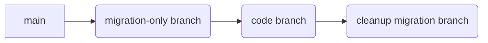

# libschema - database schema migration for libraries

[](https://pkg.go.dev/github.com/muir/libschema)


[](https://goreportcard.com/report/github.com/muir/libschema)
[](https://codecov.io/gh/muir/libschema)

Install:

	go get github.com/muir/libschema

---

## Libraries

Libschema provides a way for Go libraries to manage their own database migrations.

Tying migrations to libraries supports two things: the first is
source code locality: the migrations can be next to the code that
uses the tables that the migrations address.

The second is support for migrations in third-party libraries. This
is a relatively unexplored and unsolved problem: how can an open
source (or proprietary) library specify and maintain a database
schema? Libschema hopes to start solving this problem. 

## Register and execute

Migrations are registered:

```go
schema := libschema.New(ctx, libschema.Options{})

sqlDB, err := sql.Open("postgres", "....")

database, err := lspostgres.New(logger, "main-db", schema, sqlDB) 
// or
database, singlestoreHelper, err := lssinglestore.New(logger, "main-db", schema, sqlDB)
// or
database, mysqlHelper, err := lssinglestore.New(logger, "main-db", schema, sqlDB)

database.Migrations("MyLibrary",
	lspostgres.Script("createUserTable", `
		CREATE TABLE users (
			name	text,
			id	bigint
		)`
	}),
	lspostgres.Script("addLastLogin", `
		ALTER TABLE users
			ADD COLUMN last_login timestamp
		`
	}),
)
```

Migrations are then run run later in the order that they were registered.

```go
err := schema.Migrate(context)
```

## Computed Migrations

Migrations may be SQL strings or migrations can be done in Go:

```go
database.Migrations("MyLibrary", 
	lspostgres.Computed("importUsers", func(_ context.Context, _ Migration, tx *sql.Tx) error {
		// code to import users here
	}),
)
```

## Asynchronous migrations 

The normal mode for migrations is to run the migrations synchronously
when `schema.Migrate()` is called.  Asynchronous migrations are
started when `schema.Migrate()` is called but they're run in the
background in a go-routine.  If there are later migrations, after
the asynchronous migration, they'll force the asynchronous migration
to be synchronous unless they're also asynchronous.

## Version blocking

Migrations can be tied to specific code versions so that they are
not run until conditions are met.  This is done with `SkipRemainingIf`.
This be used to backfill data.

```go
database.Migrations("MyLibrary",
	...
	lspostgres.Script("addColumn", `
			ALTER TABLE users
				ADD COLUMN rating`,
	libschema.SkipThisAndFollowingIf(func() bool {
		return semver.Compare(version(), "3.11.3") < 1
	})),
	lspostgres.Script("fillInRatings", `
			UPDATE	users
			SET	rating = ...
			WHERE	rating IS NULL;

			ALTER TABLE users
				MODIFY COLUMN rating SET NOT NULL;`,
	libschema.Asychronous),
)
```

## Cross-library dependencies

Although it is best if the schema from one library is independent
of the schema for another, sometimes that's not possible, especially
if you want to enforce foriegn key constraints.

Use `After()` to specify a cross-library dependency.

```go
database.Migrations("users",
	...
	lspostgres.Script("addOrg", `
			ALTER TABLE users
				ADD COLUMN org TEXT,
				ADD ADD CONSTRAINT orgfk FOREIGN KEY (org)
					REFERENCES org (name) `, 
		libschema.After("orgs", "createOrgTable")),
)

database.Migrations("orgs",
	...
	lspostgres.Script("createOrgTable", `
		...
	`),
)
```

## Transactions

For databases that support transactions on metadata, all migrations
will be wrapped with a `BEGIN` and `COMMIT`.  For databases that
do not support transactions on metadata, migrations will be split
into individual commands and run one at a time.  If only some of
the commands succeed, the migration will be marked as partially
complete.  If the migration is revised, then the later parts can
be re-tried as long as the earlier parts are not modified.  This
does not apply to `Compute()`ed migrations.

### PostgreSQL idempotent (non-transactional) DDL

Postgres has a subset of DDL that must not be executed inside a transaction
(`CREATE INDEX CONCURRENTLY`, `REFRESH MATERIALIZED VIEW CONCURRENTLY`, some
`ALTER TYPE ... ADD VALUE`, etc.). Such statements must run outside an explicit
transaction block, so libschema treats them as idempotent: they must be safe to
retry. Libschema auto-detects common patterns in the `Script(...)` helper and
will run those migrations outside a transaction automatically. Examples detected:

* `CREATE [UNIQUE] INDEX CONCURRENTLY ...`
* `DROP INDEX CONCURRENTLY ...`
* `REFRESH MATERIALIZED VIEW CONCURRENTLY ...`
* `ALTER TYPE <enum> ADD VALUE ...` (treated as non-tx conservatively)

If auto-detection is insufficient or you need explicit control, use the generic
constructors directly. Forcing non-transactional execution is also an assertion
that the migration is idempotent/retry-safe:

```go
// Force transactional explicitly
lspostgres.Generate[*sql.Tx]("create-users", func(ctx context.Context, tx *sql.Tx) string {
	return `CREATE TABLE users(id bigserial PRIMARY KEY, name text)`
})

// Force non-transactional explicitly (even if not auto-detected)
lspostgres.Generate[*sql.DB]("add-concurrent-index", func(ctx context.Context, db *sql.DB) string {
	return `CREATE INDEX CONCURRENTLY IF NOT EXISTS idx_users_login ON users(last_login)`
})

// Dynamic logic still infers non-transactionality from the generic type
lspostgres.Generate[*sql.DB]("refresh-mv", func(ctx context.Context, db *sql.DB) string {
	return `REFRESH MATERIALIZED VIEW CONCURRENTLY user_aggregate`
})
```

Full guidelines (idempotency rules, single-statement enforcement for non-tx scripts,
enum examples, and how to write safe computed migrations) are in
`lspostgres/NON_TRANSACTIONAL.md`.

### RepeatUntilNoOp risks and guidance

`RepeatUntilNoOp()` is designed for migrations that perform a bounded amount of
work each run (e.g. batch-updating rows) and should run repeatedly until the
database reports "no rows changed". It relies on the `sql.Result.RowsAffected()`
value returned by the underlying driver for the single statement or for the
execution produced by a `Script(...)` or `Generate(...)` migration.

However, several classes of statements make `RowsAffected()` unreliable or
misleading. Using `RepeatUntilNoOp` with these can cause useless re-execution
(looping until an internal loop cap), or premature stop, or mask partial work.

Unreliable categories:

1. DDL statements (CREATE / ALTER / DROP / TRUNCATE / REINDEX / VACUUM, etc.)
	- Many drivers return 0 rows affected regardless of whether the DDL ran.
	- Concurrent / non-transactional Postgres operations (e.g. `CREATE INDEX CONCURRENTLY`)
	  will nearly always report 0.
2. Idempotent guard-style statements (e.g. `CREATE TABLE IF NOT EXISTS`, `ALTER TABLE ... ADD COLUMN IF NOT EXISTS`)
	- First run may return 0 even when it changed the schema, depending on driver behavior.
3. Statements producing side effects without row counts (e.g. `REFRESH MATERIALIZED VIEW CONCURRENTLY`)
	- Row count has no semantic meaning relative to "work remaining".
4. Multi-statement `Script(...)` migrations (not allowed for non-transactional Postgres, but may occur in transactional contexts)
	- The driver reports only the final statement’s rows (or an amalgam) which doesn't represent aggregate progress.
5. Vendor-specific commands (e.g. MySQL `ANALYZE TABLE`, `OPTIMIZE TABLE`) that always return a fixed metadata result.

Guidelines:

* Prefer `Computed` migrations when doing repeat-until-empty work. Inside the function you can loop, perform small batches, and stop precisely when exhausted—without relying on `RowsAffected`.
* Only use `RepeatUntilNoOp` for a single, data-changing DML statement where the driver’s row count is trustworthy (INSERT/UPDATE/DELETE on InnoDB/MySQL, Postgres standard DML, etc.).
* Avoid combining it with any DDL (even guarded with IF EXISTS / IF NOT EXISTS). DDL should generally be a one-shot migration.
* For Postgres non-transactional idempotent scripts, do not pair with `RepeatUntilNoOp`; treat them as single-execution steps. If they need conditional logic, switch to a computed migration.
* If you suspect a statement could return a spurious 0 early, add logging around first execution instead of relying solely on the repetition logic.

Failure patterns to watch for:

| Pattern | Symptom | Fix |
|---------|---------|-----|
| DDL under RepeatUntilNoOp | Always repeats once then stops (0) | Remove RepeatUntilNoOp |
| Idempotent guarded CREATE INDEX IF NOT EXISTS | Might rerun uselessly if driver lies (still 0) | Use plain script (one run) |
| Batch UPDATE with trigger-side effects | Row count may be lower than actual logical work | Use computed loop (explicit queries) |

Migration author checklist for using `RepeatUntilNoOp`:

1. Is the statement pure DML (no DDL keywords)?
2. Does the driver reliably report affected rows for this statement type?
3. Can partial failure safely be retried without harming subsequent logic?
4. Is it a single statement? (If not, refactor or use computed.)

If any answer is “no”, switch to a `Computed` migration and manage the loop manually.

In the future libschema may add defensive warnings (debug log) when `RepeatUntilNoOp` is paired with likely-unreliable statements; until then, treat this section as normative guidance.

## Command line

The `OverrideOptions` can be added as command line flags that 
change the behavior of calling `schema.Migrate()`
	
	--migrate-only			Call os.Exit() after completing migrations
	--migrate-database		Migrate only one logical database (must match NewDatabase)
	--migrate-dsn			Override *sql.DB 
	--no-migrate			Skip all migrations
	--error-if-migrate-needed	Return error if there are outstanding synchronous migrations
	--migrate-all-synchronously	Treat asychronous migrations as synchronous

## Ordering and pull requests

Migrations are run the order that they're defined.  If the set of
migrations is updated so that there are new migrations that are
earlier in the table than migrations that have already run, this
is not considered an error and the new migrations will be run anyway.
This allows multiple branches of code with migrations to be merged
into a combined branch without hassle.

Migrations can have explicit dependencies and these dependencies
can cross between libraries so that one library's migrations can
depend on anothers.

## Code structure

Registering the migrations before executing them is easier if using
library singletons.  Library singletons can be supported by using
[nserve](https://github.com/muir/nject/nserve) or
[fx](https://github.com/uber-go/fx).  With nserve, migrations can
be given their own hook.

## Driver inclusion and database support

Like database/sql, libschema requires database-specific drivers:

- PostgreSQL support is in `"github.com/muir/libschema/lspostgres"`
- MySQL support in `"github.com/muir/libschema/lsmysql"`
- SingleStore support `"github.com/muir/libschema/lssinglestore"`

libschema currently supports: PostgreSQL, SingleStore, MySQL.
It is relatively easy to add additional databases.

## Forward only

Libschema does not support reverse migrations.  If you need to fix
a migration, fix forward.  The history behind this is that reverse
migrations are rarely the right answer for production systems and
the extra work for maintaining reverse migrations is does not have
enough of a payoff during development to be worth the effort.

One way to get the benefits of reverse migrations for development
is to put enough enough reverse migrations to reverse to the last
production schema at the end of the migration list but protected
by a gateway:

```go
libschema.SkipThisAndRemainingIf(func() bool {
	return os.Getenv("LIBMIGRATE_REVERSE_TO_PROD") != "true"
}),
```

This set of reverse migrations would always be small since it would
just be enough to take you back to the current production release.

## Patterns for applying migrations

When using a migration tool like libschema there are several
reasonable patterns one can follow to apply migrations to produciton
code.

### Down-Up deploys

The simplist pattern is to deploy migrations synchronously when
rolling out updates.  If you take your service down to do deploys
then your migrations do not have to be backwards compatible.  This
has the huge upside of allowing your schema to eveolve easily and
avoid the build up of technical debt.  For example, if you have a
column whose name is sub-optimal, you can simply rename it and 
change the code that uses it at the same time.

To minimimize downtime so that the downtime doesn't matter in
practice, run expensive migrations asynchronously.  Asychronous
migrations are harder to define because they should be broken up
into a whole bunch of smallish transactions.  The `RepeatUntilNoOp()`
decorator may be useful.

### Green-Blue deploys

When you decide to run without downtime, one consequence is that
all migrations must be backwards compatible with the deployed
code.

DDL operations that are backwards compatible include:

- adding a column, table, or view
- removing a column, table, or view that is no longer accessed
- adding a default value to a column
- remvoing a constraint
- adding a constraint as long as there are no violations and won't be any new ones

From a coding point-of-view, the simplest way to manage developing
with these restrictions is to separate the migration into a separate
pull request from any other code changes.  Tests must still pass in
the pull request that just has the migration. Local and CI testing
should apply the migration and validate that the the existing code
isn't broken by the change in database schema.

Only after the migration has been deployed can code that uses the 
migration be deployed.  When using git, this can be done by having
layered side branches: 



### Kubernetes and slow migrations

One issue with using libschema to deploy changes is that servers can take
a long time to come up if there are expensive migrations that need to be
deployed first.  A solution for this is to use `OverrideOptions` to separate
the migrations into a separate step and run them in an 
[init container](https://kubernetes.io/docs/concepts/workloads/pods/init-containers/).

To do this use the `MigrateOnly` / `--migrate-only` option on your main program
when running it in the init container.

Then use the `ErrorIfMigrateNeeded` / `--error-if-migrate-needed` option on your main
program when it starts up for normal use.

## Code Stability

Libschema is still subject to changes.  Anything that is not backwards compatible
will be clearly documented and will fail in a way that does not cause hidden problems.
For example, switching from using "flag" to using OverrideOptions will trigger
an obvious breakage if you try to use a flag that no longer works.

Anticpated changes for the future:

- API tweaks
- Support for additional databases
- Support for additional logging APIs
- Support for tracing spans (per migration)
